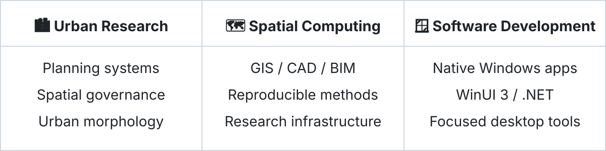

[中文](./README.md) · [日本語](./README.ja.md) · **English**

---

## Where my work connects

<picture>
  <source media="(prefers-color-scheme: dark)" srcset="./assets/work-map-en-dark.svg">
  <source media="(prefers-color-scheme: light)" srcset="./assets/work-map-en-light.svg">
  
</picture>

I’m interested in the intersection of **urban planning, spatial computing and software engineering**. Rather than treating research and development as separate tracks, I like turning planning questions, spatial data and real workflows into usable, maintainable software and research infrastructure.

---

## Selected work

<table width="100%">
<tr>
<td width="50%" valign="top">

### 🎞️ [Eizo](https://github.com/KiYouJyo/Eizo)

A native Windows personal media library designed with Japanese anime and drama in mind.

**Focus:** media recognition, metadata, playback, WebDAV and a native WinUI experience.

</td>
<td width="50%" valign="top">

### 🧰 [UrbanPlanToolbox](https://github.com/KiYouJyo/UrbanPlanToolbox)

An offline-first Windows toolbox for urban planning, architectural design and spatial research.

**Focus:** practical planning workflows, local-first tools, multilingual UX and desktop distribution.

</td>
</tr>

<tr>
<td width="50%" valign="top">

### 🗺️ [Spatial Viewer](https://github.com/KiYouJyo/SpatialViewer)

A modern Windows viewer for engineering drawings and spatial data.

**Focus:** a modular architecture for viewing CAD, GIS, BIM/IFC and Rhino data in one consistent environment.

</td>
<td width="50%" valign="top">

### 📖 [PageArc](https://github.com/KiYouJyo/PageArc)

A local-first reflowable ebook reader for Windows.

**Focus:** native reading UX, modular format conversion, library management and offline-first design.

</td>
</tr>
</table>

---

## Research & spatial computing

### 🔬 [UrbanPlanningLab](https://github.com/KiYouJyo/UrbanPlanningLab)

Long-term, reusable and reproducible research infrastructure for urban planning and territorial spatial research.

Current interests include:

- China–Japan planning-system comparison
- spatial governance in urban and non-urban areas
- urban morphology and regeneration
- GIS-based spatial analysis
- planning computation and reproducible research

### 🧭 Related projects

- **[ModernQGIS](https://github.com/KiYouJyo/ModernQGIS)** — an experimental modern desktop shell and interaction architecture built around QGIS capabilities.
- **[ReferenceCity](https://github.com/KiYouJyo/ReferenceCity)** — standardized synthetic city environments for reproducible spatial experiments and method validation.
- **[SpatialViewer.GisCore](https://github.com/KiYouJyo/SpatialViewer.GisCore)** — GIS-oriented core work behind the Spatial Viewer family.

---

## Currently

- Building **Eizo** as a modular Windows media platform.
- Developing reusable **data, methods and software infrastructure for urban-planning research**.
- Exploring ways to connect **GIS, CAD/BIM and native desktop UX** while keeping module boundaries clear.

---

## Tools I use

**Development**  
`C#` · `.NET` · `WinUI 3` · `Windows App SDK` · `Python` · `C++` · `Qt`

**Spatial & planning**  
`GIS` · `QGIS` · `CAD` · `BIM / IFC` · `Spatial Analysis`

**Research**  
`Urban Planning` · `Urban Morphology` · `Spatial Governance` · `China–Japan Comparative Planning`

---

### Build tools. Study cities. Connect both.

[View all repositories](https://github.com/KiYouJyo?tab=repositories)

